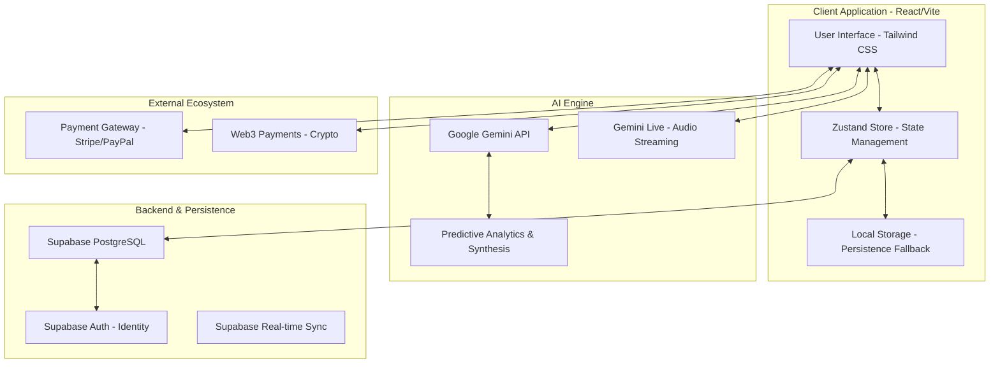

# Vinetelligence System Architecture

## Data Flow Descriptions

1. **User Interaction**: Staff or Guests interact with the React frontend.
2. **State Management**: Zustand orchestrates local state, ensuring UI responsiveness.
3. **Intelligence Loop**: 
   - Non-blocking calls to Gemini API for menu synthesis and inventory prediction.
   - Low-latency WebSocket connections for the AI Avatar (Gemini Live).
4. **Synchronization**: 
   - `supabaseSync.ts` handles background persistence to the cloud silo.
   - LocalStorage provides immediate recovery for offline-first resilience.
5. **Fiscal Processing**:
   - `FinancialEngine` routes settlement requests to Stripe, PayPal, or Crypto gateways.
   - Transactions are recorded in Supabase and verified via RLS (Row Level Security).
